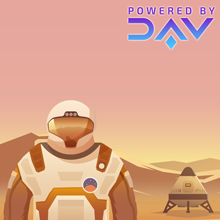

# Missions
> By DAV

Missions is the client facing side of the marketplace connecting DAV users looking to ship packages, with autonomous vehicles.

It demonstrates how a third party might build their own product, while integrating technologies provided by DAV, and provide a way for users and autonomous vehicles to transact.

### Mission App is currently under heavy construction!

Feel free to **Star** and **Watch** it, but watch out for falling debris, and a wildly changing API.

Feedback and contributions are always welcome and appreciated.

### License

Licensed under [MIT](https://github.com/DAVFoundation/missioncontrol/blob/master/LICENSE).
